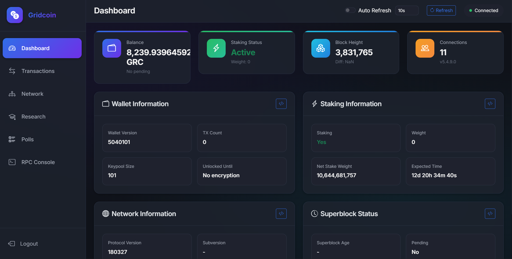

# Gridcoin RPC UI

A modern, beautiful web dashboard for monitoring and managing your Gridcoin wallet via RPC. Built with Python 3.13, Flask, and Bootstrap 5.



## Features

- 🎨 **Modern Dark Theme** - Glassmorphism design with smooth animations
- 📊 **Dashboard** - Real-time overview of wallet, staking, and network status
- 💰 **Transactions** - View recent transaction history with filtering
- 💳 **Addresses** - View all wallet addresses, balances, and labels
- 🌐 **Network** - Connected peers and network statistics
- 🔬 **Research** - BOINC/CPID information and beacon status
- 🗳️ **Polls** - View active governance polls
- 💻 **RPC Console** - Execute custom RPC commands with command history
- 🔄 **Auto-refresh** - Configurable automatic data refresh
- 🔐 **Authentication** - Single-user login protection

## Requirements

- Docker and Docker Compose
- Gridcoin daemon running with RPC enabled
- Gridcoin daemon running with RPC enabled

## Quick Start

### 1. Get the Code
 
 ```bash
 git pull https://github.com/AhmadShamli/Gridcoin-RPC-UI.git
 ```
 
 ### 2. Configure Environment

Copy the example environment file and edit it:

```bash
cp .env.docker .env
```

Edit `.env` with your Gridcoin RPC credentials:

```env
GRIDCOIN_RPC_HOST=host.docker.internal
GRIDCOIN_RPC_PORT=15715
GRIDCOIN_RPC_USER=your_rpc_username
GRIDCOIN_RPC_PASSWORD=your_rpc_password
SECRET_KEY=generate-a-secure-random-key
APP_USERNAME=admin
APP_PASSWORD=your-secure-password
```

### 3. Deploy with Docker Compose

```bash
docker compose up -d
```

The app will be available at `http://localhost:5000`

## Gridcoin RPC Configuration

Make sure your Gridcoin configuration (`gridcoinresearch.conf`) has RPC enabled:

```conf
server=1
rpcuser=your_rpc_username
rpcpassword=your_rpc_password
rpcport=15715
rpcallowip=172.16.0.0/12
rpcallowip=192.168.0.0/16
rpcallowip=10.0.0.0/8
```

Since Gridcoin runs with host network mode, the web app connects via `host.docker.internal`.

## Development

### Local Development

1. Create virtual environment:
```bash
python -m venv venv
source venv/bin/activate  # Linux/Mac
venv\Scripts\activate     # Windows
```

2. Install dependencies:
```bash
pip install -r requirements.txt
```

3. Copy environment file:
```bash
cp .env.example .env
```

4. Run development server:
```bash
python app.py
```

## Project Structure

```
Gridcoin-RPC-UI/
├── app.py              # Flask application
├── config.py           # Configuration management
├── rpc_client.py       # Gridcoin RPC client
├── requirements.txt    # Python dependencies
├── Dockerfile          # Docker build file
├── docker-compose.yml  # Docker Compose configuration
├── templates/          # Jinja2 HTML templates
│   ├── base.html
│   ├── login.html
│   ├── dashboard.html
│   ├── transactions.html
│   ├── addresses.html
│   ├── network.html
│   ├── research.html
│   ├── polls.html
│   └── rpc_console.html
└── static/
    ├── css/
    │   └── style.css
    └── js/
        ├── app.js
        ├── dashboard.js
        ├── transactions.js
        ├── addresses.js
        ├── network.js
        ├── research.js
        ├── polls.js
        └── console.js
```

## Security Notes

- Change the default `APP_USERNAME` and `APP_PASSWORD` before deploying
- Generate a strong random `SECRET_KEY`
- Use HTTPS in production (consider using a reverse proxy like Nginx)
- Restrict RPC access in your Gridcoin configuration

## License

MIT License
